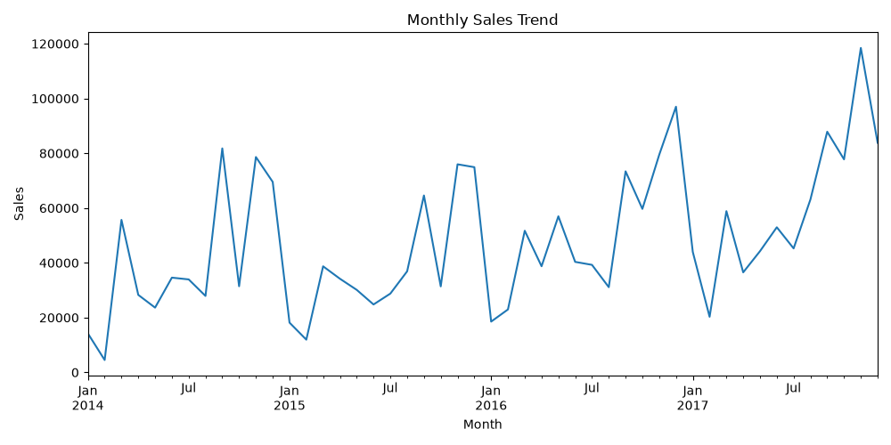
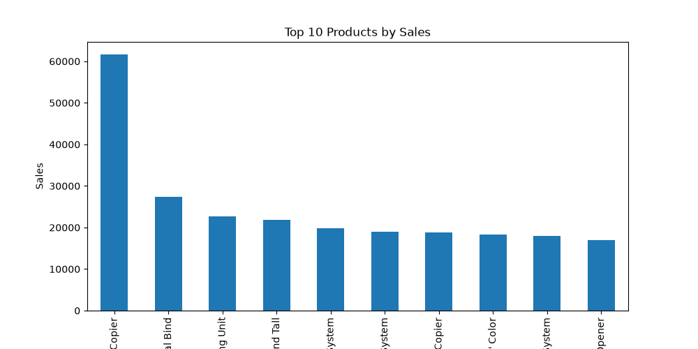
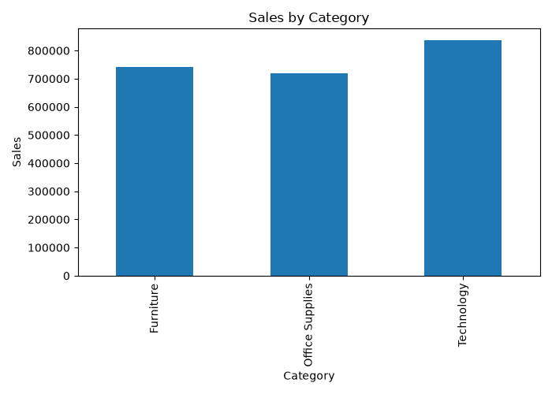

# E-Commerce Sales Analytics Dashboard

## Overview

This project analyzes e-commerce sales data to generate business insights and performance metrics. Using Python for data analysis and visualization, the project identifies sales trends, top-performing products, and category-wise performance while generating key business KPIs.

---

## Features

* Sales Trend Analysis
* Product Performance Analysis
* Category-Wise Sales Analysis
* KPI Dashboard Metrics
* Business Intelligence Reporting
* Data Visualization

---

## Technologies Used

* Python
* Pandas
* NumPy
* Matplotlib
* Excel

---

## Dataset

Sample Superstore Dataset containing customer orders, sales, profit, category, and product information.

---

## Project Workflow

1. Data Collection
2. Data Cleaning
3. Data Preprocessing
4. Sales Analysis
5. Product Analysis
6. KPI Generation
7. Data Visualization
8. Business Insights

---

## Results

### Monthly Sales Trend

### Top 10 Products by Sales

### Sales by Category

---

## Dashboard KPIs

| Metric          | Value         |
| --------------- | ------------- |
| Total Sales     | $2,297,200.86 |
| Total Profit    | $286,397.02   |
| Total Orders    | 5009          |
| Total Customers | 793           |

---

## Key Insights

* Generated over $2.29M in total sales.
* Achieved $286K total profit across all orders.
* Processed 5009 customer orders.
* Served 793 unique customers.
* Identified top-performing products and categories.
* Analyzed monthly sales trends for business planning.

---

## Project Structure

E-Commerce-Sales-Analytics-Dashboard/
│
├── data/
├── src/
│   ├── data_preprocessing.py
│   ├── sales_analysis.py
│   └── dashboard_metrics.py
│
├── results/
│   ├── monthly_sales_trend.png
│   ├── top_products.png
│   ├── sales_by_category.png
│   └── kpi_report.txt
│
├── dashboard/
├── notebooks/
├── README.md
├── requirements.txt
└── .gitignore

---

## Author

**Panjala Shambhavi**

B.Tech Artificial Intelligence & Machine Learning (AIML)
